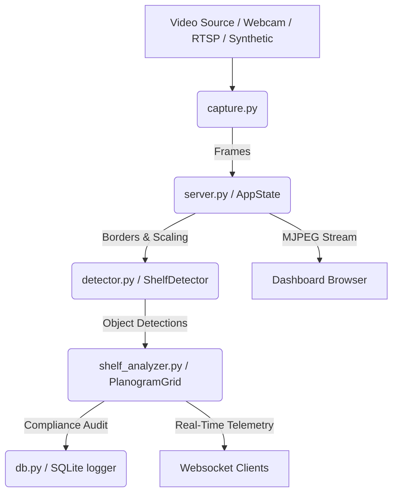

# 🛠️ Aether-Shelf AI: Development & Custom Model Training Guide

Welcome to the development guide for the **Aether-Shelf AI Retail Shelf Monitor**. This document provides an architectural walkthrough, database schemas, instructions for custom dataset preparation, model training using YOLOv8, and troubleshooting.

---

## 🏗️ System Architecture

Aether-Shelf AI is structured into decoupled modules to enable easy extension, hardware swap, or database migration.



### Key Modules

1. **`server.py`**: The central application coordinator. It manages FastAPI endpoints, WebSocket state telemetry (`/ws/stats`), MJPEG live video stream (`/video_feed`), SLA CSV exports, and hot-swappable model controls.
2. **`detector.py`**: Wraps PyTorch YOLOv8. Includes auto-device selection (CUDA > MPS > CPU), custom confidence/IoU threshold settings, and high-fidelity Simulation fallback mode when Ultralytics or weights are missing.
3. **`shelf_analyzer.py`**: The business compliance engine. Implements the grid coordinates mapping, OOS (out-of-stock) duration alerts, misplaced product detection, camera blur/illumination audit, and stockout predictive forecasting.
4. **`capture.py`**: Threaded frame grabber with automatic reconnect. Contains a high-fidelity interactive simulation mode with simulated hands reaching and restocking products.
5. **`db.py`**: Handles transactional SQLite logging for alerts and aggregated performance analytics.

---

## 📦 Database Schema

Persistent compliance telemetry is stored locally in `data/compliance.db`.

### 1. `compliance_events`
Logs planogram discrepancies (OOS, Misplaced) as they happen:

| Column | Type | Description |
| :--- | :--- | :--- |
| `id` | `INTEGER` | Primary Key, Auto-increment |
| `timestamp` | `REAL` | Unix timestamp of event occurrence |
| `datetime_str` | `TEXT` | Human-readable datetime string |
| `event_type` | `TEXT` | `'oos'`, `'misplaced'`, or `'ok'` |
| `shelf_id` | `INTEGER` | Shelf index (0 to Rows-1) |
| `slot_id` | `INTEGER` | Slot index (0 to Columns-1) |
| `expected_class`| `TEXT` | Target SKU expected in planogram slot |
| `current_class` | `TEXT` | YOLOv8-detected SKU |
| `duration` | `REAL` | Duration of Out-of-Stock/discrepancy (seconds) |

### 2. `hourly_stats`
Aggregated hourly telemetry reports:

| Column | Type | Description |
| :--- | :--- | :--- |
| `id` | `INTEGER` | Primary Key, Auto-increment |
| `timestamp` | `REAL` | Hour timestamp |
| `datetime_str` | `TEXT` | ISO-8601 Datetime string |
| `occupancy_rate`| `REAL` | Percentage of occupied cells (0-100%) |
| `oos_count` | `INTEGER` | Total number of OOS occurrences |
| `misplaced_count`| `INTEGER` | Total number of misplaced items |
| `compliance_rate`| `REAL` | Overall planogram compliance rate (0-100%) |

---

## 🎯 Fine-Tuning YOLOv8 on Custom Retail Datasets

To run detection on custom retail brands (e.g. Coca-Cola, Lay's, Perrier), you can fine-tune YOLOv8 using `train.py` and `data_aug.py`.

### Step 1: Prepare the Dataset
By default, Aether-Shelf expects the popular **SKU-110K** dataset or a custom dataset structured in YOLO format:

```text
data/sku110k/
├── images/
│   ├── train/
│   └── val/
└── labels/
    ├── train/
    └── val/
```

If you use SKU-110K, download it and run the automatic converter to convert absolute coordinates (CSV format) to YOLO normalized formats:
```bash
python3 train.py --setup --convert
```

### Step 2: Augment Dataset with Custom Shelf Distortions
Shelf monitoring requires high robustness to specific storefront anomalies (fluorescent glare, shadow bands, price tags). 

The `data_aug.py` script applies customized transforms (using `albumentations`):
* **Horizontal shadow bands**: Simulates physical shelf dividers casting shadows.
* **Fluorescent flicker**: Modifies contrast/brightness dynamically.
* **Price tag occlusions**: Overlays small white blocks to mimic tag inserts.
* **Geometric distortions**: Simulates steep wide-angle CCTV viewing angles.

Run data augmentation on your training set to expand size and accuracy:
```bash
python3 data_aug.py --augment --images data/sku110k/images/train --labels data/sku110k/labels/train --output data/augmented
```

### Step 3: Run YOLOv8 Training
Start fine-tuning the detector. It optimizes training hyper-parameters using AdamW:
```bash
python3 train.py --train --model n --epochs 50 --batch 16
```
Options for `--model`:
* `n`: Nano (under 7MB, ideal for edge CPUs/embedded)
* `s`: Small (balanced latency/precision)
* `m`: Medium (highly accurate, requires GPU)

### Step 4: Export to ONNX / OpenVINO
For production environments, export the model to a high-speed runtime format:
```bash
python3 train.py --export
```

---

## 🔍 System Verification & Testing

Always verify the local environment health using the custom diagnostic utility:
```bash
python3 diagnose.py
```
This utility:
1. Validates the installed version of PyTorch and tests GPU compute backend (CUDA/MPS).
2. Verifies versions and imports of all dependencies inside `requirements.txt`.
3. Assures database setup, schema integrity, and validates database tables.
4. Loads the detector and performs a 10-cycle inference benchmark, listing latency (ms) and real-world edge FPS.

---

## 🛠️ Troubleshooting

### 1. High CPU Latency or Frame Drops
* Lower the resolution scaling or max frame rate sliders inside the **Settings & Control** sidebar on the dashboard.
* If you have no hardware GPU acceleration, load the `yolov8n.pt` (Nano) model, which is optimized for CPU execution.

### 2. Camera Health Alert Fired
* **Illumination Alert**: Check if the shelf lighting is off or if the camera lens is covered.
* **Blur Alert**: Clean the camera lens or refocus the sensor.

### 3. Database is Locked
* If running multi-worker setups, SQLite might experience write contention. Ensure the workers run on a single-thread configuration or adjust ASGI configurations to run a single worker (default in `Dockerfile`).
